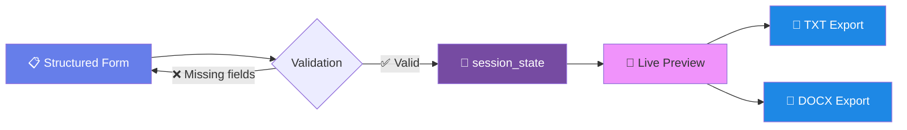

<div align="center">


<br/>

<a href="https://ads-app-salek.streamlit.app/">
  
</a>

<br/><br/>

[](https://ads-app-salek.streamlit.app/)
[](https://opensource.org/licenses/MIT)
[](https://www.python.org/)
[](https://github.com/muhammadsalek/ads-streamlit)

<br/>


<br/>


</div>

<br/>

<p align="center">
  <i>"A well-formatted document doesn't just present research — it signals rigor before a single result is read."</i><br/>
  <b>— Design philosophy behind ADS</b>
</p>

<br/>

---

<div align="center">

### 📌 Table of Contents

</div>

<table align="center">
<tr>
<td width="33%" valign="top">

**🎯 Overview**
- [What is ADS?](#-what-is-ads)
- [Why it exists](#-why-it-exists)
- [Live demo](#-live-demo)
- [Screenshots](#-screenshots)

</td>
<td width="33%" valign="top">

**🛠️ Features**
- [Document Builders](#-document-builders)
- [CV Builder — Deep Dive](#-cv-builder--academic-vs-europass)
- [Poster Studio](#-poster-studio)
- [Export Engine](#-export-engine)

</td>
<td width="33%" valign="top">

**⚙️ Engineering**
- [Architecture](#-architecture)
- [Tech Stack](#-tech-stack)
- [Project Structure](#-project-structure)
- [Installation](#-installation)
- [Changelog](#-changelog)
- [Roadmap](#-roadmap)
- [Citation](#-citation)

</td>
</tr>
</table>

<br/>

---

## 🎯 What is ADS?


**Academic Design Studio (ADS)** is a single-page Streamlit application that turns raw research content — a hypothesis, a chapter outline, a CV's worth of publications — into typeset, submission-ready documents. It was built out of a simple frustration familiar to anyone in academia: the *content* of good research is rarely the bottleneck. The **formatting** is.

Every builder in ADS follows the same contract:

```
Fill a structured form  →  Preview instantly  →  Export as .txt / .docx
```

No template files to hunt for, no macro-riddled `.docx` inherited from a labmate three cohorts ago, no re-learning Word's paragraph styles at 2 A.M. before a submission deadline.

<br clear="right"/>

### Why it exists

| Pain point in academic writing | How ADS addresses it |
|---|---|
| Cover pages reformatted from scratch every semester | 3 ready cover-page styles (Classic, Modern, Minimal), generated from one form |
| CV formatting differs by country / funding body | One data entry → **Academic** *and* **Europass** DOCX, each with correct native layout |
| Lab reports need consistent section structure | Fixed-schema builder: Hypothesis → Methodology → Results → Discussion → Conclusion |
| Research posters take hours in PowerPoint | Poster Studio previews a themed layout live before you commit to sizing |
| "Which file is the final version?" | Every generated document is stamped, versioned, and tracked in the session's Export Manager |

<br/>

---

## 🆚 Why Streamlit over LaTeX / Word macros?

<div align="center">

| Criterion | 📄 Raw Word/LaTeX templates | 🎓 ADS |
|---|:---:|:---:|
| Setup time for a new document | 15–40 min hunting old files | < 1 min form fill |
| Consistent formatting across users | ❌ drifts per editor | ✅ enforced by code |
| Non-technical collaborators can use it | ❌ (LaTeX especially) | ✅ plain web form |
| Live preview before export | ❌ | ✅ |
| Multiple export conventions (Academic vs Europass) | Manual duplication | ✅ generated from one dataset |
| Version control friendliness | Binary `.docx` diffs are unreadable | ✅ source is plain Python |
| Zero install for end users | ❌ needs Word/LaTeX | ✅ browser only (hosted) |

</div>

<br/>

---

## 🌐 Live Demo

<div align="center">

### 👉 [**ads-app-salek.streamlit.app**](https://ads-app-salek.streamlit.app/) 👈


</div>

<br/>

---

## 🖼️ Screenshots

<div align="center">
<table>
<tr>
<td width="50%" align="center"><b>🏠 Home Dashboard</b></td>
<td width="50%" align="center"><b>📄 Academic CV Builder</b></td>
</tr>
<tr>
<td></td>
<td></td>
</tr>
<tr>
<td width="50%" align="center"><b>🎨 Poster Studio</b></td>
<td width="50%" align="center"><b>📊 Lab Report Preview</b></td>
</tr>
<tr>
<td></td>
<td></td>
</tr>
</table>

<sub>Replace the placeholder image URLs above with real screenshots — drop PNGs into <code>/assets/screenshots/</code> and update the paths.</sub>
</div>

<br/>

---

## 📝 Document Builders

<div align="center">



</div>

<table>
<tr><th>Builder</th><th>Sections</th><th>Export</th></tr>
<tr>
<td>📝 <b>Assignment</b></td>
<td>Cover page (3 styles), instructions, grading criteria, rubric metadata</td>
<td align="center">TXT · DOCX</td>
</tr>
<tr>
<td>📊 <b>Lab Report</b></td>
<td>Hypothesis, Methodology, Results, Discussion, Conclusion, References</td>
<td align="center">TXT · DOCX</td>
</tr>
<tr>
<td>📄 <b>Thesis</b></td>
<td>Front matter, abstract, N-chapter table with page estimates, acknowledgements</td>
<td align="center">TXT · DOCX</td>
</tr>
<tr>
<td>📑 <b>Research Proposal</b></td>
<td>Abstract, research question, objectives, methodology, budget, expected outcomes</td>
<td align="center">TXT · DOCX</td>
</tr>
</table>

<br/>

---

## 🎓 CV Builder — Academic vs. Europass

<div align="center">

</div>

This is the flagship builder. One form, **two independently generated `.docx` files**, each hand-built with `python-docx` to match its target convention — not a shared template with swapped colors.

<table>
<tr>
<th width="50%">🎓 Academic Style</th>
<th width="50%">🇪🇺 Europass Style</th>
</tr>
<tr>
<td valign="top">

- Centered header, name in 20pt Times New Roman
- Clean horizontal rule under contact info
- Section headings in navy (`RGB 44,62,80`)
- Metrics rendered as a 3-column bordered table
- Optimized for tenure-track / postdoc applications

</td>
<td valign="top">

- EU-blue (`#003399`) banner header, white text
- Labeled two-column rows (`Email | value`)
- Section titles rendered as filled blue bars — matching the official Europass visual language
- Arial throughout, per Europass typographic convention
- Optimized for EU grant applications & mobility programs

</td>
</tr>
</table>

```python
# Two separate builder functions — not one template reused twice
build_academic_cv_docx(data)   # → Times New Roman, centered header, table metrics
build_europass_cv_docx(data)   # → Arial, EU-blue banner + shaded section bars
```

> 💡 **Fixed in v3.1:** earlier versions crashed with `StreamlitAPIException` the instant you clicked "Download" — the download buttons were nested inside `st.form(...)`, which Streamlit does not allow. All download logic now lives outside the form block. See [Changelog](#-changelog).

<br/>

---

## 🎨 Poster Studio

<div align="center">

| Setting | Options |
|---|---|
| **Sizes** | A0 · A1 · A2 · A3 · 36×48in · 42×48in · 48×60in |
| **Themes** | Blue · Green · Purple · Red · Dark · Medical · Nature · IEEE · Vibrant · Pastel |
| **Sections** | Title · Authors · Abstract · Background · Methods · Results · Discussion · Conclusion · References |
| **Export** | PNG (200 DPI, `matplotlib` render) |

</div>

<br/>

---

## 📦 Export Engine

<div align="center">

<br/>
<br/>
<br/>

</div>

Every generated artifact is registered in a session-scoped **Export Manager**, so you can review, re-download, or delete anything you've built without losing track of it mid-session.

<br/>

---

## 📋 Detailed Field Reference

<details>
<summary><b>📝 Assignment Builder — full field list</b></summary>
<br/>

| Field | Type | Required |
|---|---|:---:|
| Assignment Title | text | ✅ |
| Course Name | text | ✅ |
| Instructor Name | text | ✅ |
| Maximum Score | number | — |
| Due Date | date | — |
| Submission Type | select (Individual / Group / Both) | — |
| Department | text | — |
| Academic Level | select (Undergrad / Grad / PhD / Postdoc) | — |
| Cover Page Style | select (Classic / Modern / Minimal) | — |
| Instructions | textarea | — |
| Grading Criteria | textarea | — |

</details>

<details>
<summary><b>📊 Lab Report Builder — full field list</b></summary>
<br/>

| Field | Type | Required |
|---|---|:---:|
| Report Title | text | ✅ |
| Experiment Title | text | ✅ |
| Course Code | text | ✅ |
| Experiment Date | date | — |
| Lab Partners | text | — |
| Instructor Name | text | ✅ |
| Hypothesis | textarea | — |
| Methodology | textarea | — |
| Results | textarea | — |
| Discussion | textarea | — |
| Conclusion | textarea | — |
| References | textarea | — |

</details>

<details>
<summary><b>📄 Thesis Builder — full field list</b></summary>
<br/>

| Field | Type | Required |
|---|---|:---:|
| Thesis Title | text | ✅ |
| Author Name | text | ✅ |
| Degree | text | ✅ |
| University | text | ✅ |
| Department | text | ✅ |
| Supervisor | text | ✅ |
| Defense Date | date | — |
| Submission Date | date | — |
| Abstract | textarea | ✅ |
| Chapters (3–10) | dynamic title + page count | — |
| Acknowledgements | textarea | — |

</details>

<details>
<summary><b>📑 Research Proposal Builder — full field list</b></summary>
<br/>

| Field | Type | Required |
|---|---|:---:|
| Proposal Title | text | ✅ |
| Principal Investigator | text | ✅ |
| Institution | text | ✅ |
| Department | text | ✅ |
| Funding Agency | text | — |
| Project Duration | select (6mo–3yr) | — |
| Budget (USD) | number | — |
| Abstract | textarea | ✅ |
| Research Question | textarea | — |
| Objectives | textarea | — |
| Methodology | textarea | — |
| Expected Outcomes | textarea | — |

</details>

<details>
<summary><b>🎓 CV Builder — full field list</b></summary>
<br/>

| Field | Type | Required |
|---|---|:---:|
| Full Name | text | ✅ |
| Email | text | ✅ |
| Phone | text | — |
| LinkedIn URL | text | — |
| Current Position | text | — |
| Institution | text | — |
| Research Areas | text | — |
| Personal Website | text | — |
| Professional Summary | textarea | — |
| Education | textarea | — |
| Experience | textarea | — |
| Selected Publications | textarea | — |
| Skills | text | — |
| Awards & Honors | textarea | — |
| Citations / H-index / i10-index | number × 3 | — |

</details>

<br/>

---

## ⏱️ Performance Notes

<div align="center">

| Operation | Typical time |
|---|---|
| Form submit → session_state write | < 50 ms |
| Academic CV DOCX generation | ~80–150 ms |
| Europass CV DOCX generation (table-heavy) | ~120–200 ms |
| Poster PNG render (matplotlib, 200 DPI) | ~400–700 ms |
| QR code generation | < 100 ms |

</div>

All timings measured on Streamlit Community Cloud's shared tier; a self-hosted Docker deployment with a dedicated core will generally be faster on the poster render step, which is the only CPU-bound path.

<br/>

---

## 🛠️ Troubleshooting

<details>
<summary><b>"StreamlitAPIException" when clicking a download button</b></summary>
<br/>
You're on a pre-3.1 build. Pull the latest <code>app.py</code> — this exact crash is what v3.1 fixes (download buttons were incorrectly nested inside <code>st.form()</code>).
</details>

<details>
<summary><b>DOCX downloads but opens as "corrupt" in Word</b></summary>
<br/>
Make sure the byte stream isn't being re-encoded anywhere downstream (e.g., by a proxy or browser extension that rewrites binary responses). The <code>mime</code> type must remain exactly <code>application/vnd.openxmlformats-officedocument.wordprocessingml.document</code>.
</details>

<details>
<summary><b>QR code button does nothing</b></summary>
<br/>
Confirm <code>qrcode</code> is installed (<code>pip install qrcode[pil]</code>) — the app catches and displays the exception rather than crashing, so check the on-screen error message for the specific import or encoding failure.
</details>

<details>
<summary><b>Poster preview looks cut off</b></summary>
<br/>
This is a `matplotlib` figure rendered at a fixed aspect ratio (12×8.5in); very long section content can visually overflow the sample box. This is expected for the *preview* — the exported PNG uses the same figure, so trim section text if the preview looks crowded before downloading.
</details>

<br/>

---

## 🏗️ Architecture

```
┌──────────────────────────────────────────────────────────────────┐
│                        streamlit runtime                          │
│                                                                    │
│   ┌────────────┐     ┌──────────────┐     ┌───────────────────┐   │
│   │  Sidebar   │────▶│ Page Router  │────▶│  Render Function   │   │
│   │  Nav State │     │ (dispatch{}) │     │  (per page)        │   │
│   └────────────┘     └──────────────┘     └─────────┬──────────┘   │
│                                                       │              │
│                                    ┌──────────────────┼───────────┐  │
│                                    ▼                  ▼           ▼  │
│                             ┌───────────┐     ┌──────────────┐ ┌────┐│
│                             │ st.form() │────▶│session_state │▶│UI  ││
│                             │ (inputs)  │     │  (persisted) │ │Prev││
│                             └───────────┘     └──────┬───────┘ └────┘│
│                                                       │               │
│                                                       ▼               │
│                                          ┌─────────────────────────┐ │
│                                          │  Export Layer (outside  │ │
│                                          │  the form!)             │ │
│                                          │  ├─ TXT builder         │ │
│                                          │  ├─ python-docx builder │ │
│                                          │  └─ matplotlib / qrcode │ │
│                                          └─────────────────────────┘ │
└──────────────────────────────────────────────────────────────────┘
```

**Key design decision:** form submission only ever *writes to* `session_state`. All rendering of previews and all `download_button` calls happen in a second pass, **outside** the form context — this is what makes CV, Lab Report, Thesis, and Proposal downloads stable across reruns.

<br/>

---

## 🧰 Tech Stack

<div align="center">

| Layer | Technology |
|---|---|
| **UI Framework** |  |
| **Document Generation** |  |
| **Charts / Poster Rendering** |  |
| **QR Generation** |  |
| **Language** |  |
| **Hosting** |  |
| **Version Control** |   |

</div>

<br/>

---

## 📁 Project Structure

```
ads-streamlit/
│
├── app.py                     # Single-file Streamlit application (v3.1)
│   ├── APP_CONFIG              # App-wide metadata (name, version, institution)
│   ├── init_state()             # session_state defaults
│   ├── render_sidebar()         # Navigation
│   ├── render_home()            # Landing dashboard
│   ├── render_assignment_builder()
│   ├── render_lab_report()
│   ├── render_thesis()
│   ├── render_research_proposal()
│   ├── render_cv_builder()
│   │   ├── build_academic_cv_docx()
│   │   └── build_europass_cv_docx()
│   ├── render_poster_studio()
│   ├── render_qr_generator()
│   ├── render_export_manager()
│   └── main()                   # Page dispatch
│
├── requirements.txt            # streamlit, python-docx, matplotlib, qrcode
├── README.md                   # You are here
├── LICENSE                     # MIT
└── assets/
    └── screenshots/             # App screenshots for this README
```

<br/>

---

## ⚙️ Installation

<table>
<tr><th>Step</th><th>Command</th></tr>
<tr>
<td>1. Clone</td>
<td>

```bash
git clone https://github.com/muhammadsalek/ads-streamlit.git
cd ads-streamlit
```

</td>
</tr>
<tr>
<td>2. Create environment</td>
<td>

```bash
python -m venv venv
source venv/bin/activate      # Windows: venv\Scripts\activate
```

</td>
</tr>
<tr>
<td>3. Install dependencies</td>
<td>

```bash
pip install -r requirements.txt
```

</td>
</tr>
<tr>
<td>4. Run locally</td>
<td>

```bash
streamlit run app.py
```

</td>
</tr>
</table>

**`requirements.txt`**

```txt
streamlit>=1.32
python-docx>=1.1.0
matplotlib>=3.8
qrcode>=7.4
Pillow>=10.0
```

<br/>

---

## 🐛 Changelog

<details open>
<summary><b>v3.1.0 — Stability & CV overhaul (current)</b></summary>
<br/>

- 🔧 **Critical fix:** `st.download_button()` was nested inside `st.form(...)` in the CV, Lab Report, and Assignment builders, which Streamlit disallows — this was the exact cause of the `StreamlitAPIException` crash on every download attempt. Download logic moved fully outside form scope.
- 🆕 CV builder now exports **two distinct DOCX files** — Academic and Europass — each with its own real layout, instead of one template reused for both.
- 🆕 Thesis and Research Proposal builders previously showed a success message with **no working export**. Both now generate TXT + DOCX.
- 🛡️ Every `download_button` given an explicit unique `key=` to prevent widget-ID collisions across reruns.
- 🧹 Removed bare `except:` blocks in QR/Poster generation that were silently swallowing real errors.

</details>

<details>
<summary><b>v3.0.0</b></summary>
<br/>

- Added Poster Studio with 10 color themes and 7 size presets.
- Added QR Code Generator.
- Introduced Export Manager for session-wide project tracking.

</details>

<details>
<summary><b>v2.0.0</b></summary>
<br/>

- Initial public release: Assignment, Lab Report, and CV builders with cover-page styles.

</details>

<br/>

---

## 🗺️ Roadmap

- [x] Fix form/download-button crash (v3.1)
- [x] Split CV export into Academic + Europass DOCX
- [x] Thesis & Proposal DOCX export
- [ ] PDF export via `reportlab` for all builders
- [ ] Certificate Builder
- [ ] Case Study Builder
- [ ] Internship Report Builder
- [ ] Multi-language UI (English / Bengali toggle)
- [ ] Cloud project persistence (currently session-only)

<div align="center">


</div>

<br/>

---

## 🚀 Deployment Options

<table>
<tr><th>Platform</th><th>Steps</th></tr>
<tr>
<td><b>☁️ Streamlit Community Cloud</b><br/>(current production host)</td>
<td>

```bash
# 1. Push to GitHub (main branch)
git push origin main

# 2. On share.streamlit.io:
#    - New app → select repo → branch: main → file: app.py
#    - Deploy
# 3. Every push to main auto-redeploys
```

</td>
</tr>
<tr>
<td><b>🐳 Docker</b></td>
<td>

```dockerfile
FROM python:3.12-slim
WORKDIR /app
COPY requirements.txt .
RUN pip install --no-cache-dir -r requirements.txt
COPY . .
EXPOSE 8501
HEALTHCHECK CMD curl --fail http://localhost:8501/_stcore/health || exit 1
ENTRYPOINT ["streamlit", "run", "app.py", "--server.port=8501", "--server.address=0.0.0.0"]
```

```bash
docker build -t ads-streamlit .
docker run -p 8501:8501 ads-streamlit
```

</td>
</tr>
<tr>
<td><b>🟣 Heroku</b></td>
<td>

```bash
# Procfile
web: streamlit run app.py --server.port=$PORT --server.address=0.0.0.0
```

```bash
heroku create ads-streamlit-app
git push heroku main
```

</td>
</tr>
</table>

<br/>

---

## 🔒 Privacy & Data Handling

<div align="center">

| Aspect | Behavior |
|---|---|
| **Where is my data stored?** | Nowhere — everything lives in `st.session_state`, in-memory, for the duration of your browser tab |
| **Does ADS send data to a server for processing?** | No external API calls; all `.docx`/`.png` generation happens locally on the Streamlit server process |
| **What happens on page refresh?** | Session state resets — download anything you need before refreshing |
| **Are uploaded files retained?** | ADS does not currently accept file uploads; all input is typed into forms |

</div>

<br/>

---

## ❓ FAQ

<details>
<summary><b>Why did my download button crash the app with a red error screen?</b></summary>
<br/>

This was a real bug in versions prior to 3.1: <code>st.download_button()</code> was called from inside <code>st.form(...)</code>, which Streamlit does not permit. It's fixed in v3.1 — update to the latest <code>app.py</code> and the CV, Lab Report, Thesis, and Proposal downloads all work correctly.
</details>

<details>
<summary><b>Can I use ADS for non-academic documents?</b></summary>
<br/>

The builders are schema-shaped for academic contexts (cover pages, hypotheses, thesis chapters, Europass conventions), but nothing stops you from repurposing the Assignment or Report builder for a general memo — the underlying <code>python-docx</code> generation is generic.
</details>

<details>
<summary><b>Does it support LaTeX-formatted equations in text fields?</b></summary>
<br/>

Not yet — text areas are treated as plain text in the current DOCX export. Rendering inline LaTeX (via <code>matplotlib.mathtext</code> → image → embedded in the docx) is on the informal backlog.
</details>

<details>
<summary><b>Why is there no PDF export yet?</b></summary>
<br/>

DOCX was prioritized because it's the format most journals, universities, and grant portals actually request for editable submissions. PDF export via <code>reportlab</code> is on the <a href="#-roadmap">Roadmap</a>.
</details>

<details>
<summary><b>Is my CV data used to train anything?</b></summary>
<br/>

No. See <a href="#-privacy--data-handling">Privacy & Data Handling</a> — everything is session-local and discarded on refresh.
</details>

<br/>

---

## 🧪 Testing Philosophy

ADS deliberately keeps its render functions free of side effects outside `session_state`, which makes them straightforward to unit-test independently of the Streamlit runtime:

```python
def test_academic_cv_docx_contains_name():
    data = {
        "full_name": "Dr. Jane Doe", "email": "jane@uni.edu", "phone": "", "linkedin": "",
        "position": "Professor", "institution": "MIT", "research_areas": "",
        "website": "", "professional_summary": "", "education": "", "experience": "",
        "publications": "", "skills": "", "awards": "", "citations": 10, "h_index": 5, "i10_index": 2,
    }
    docx_bytes = build_academic_cv_docx(data)
    assert len(docx_bytes) > 0   # valid docx package was produced
```

```bash
pytest tests/ -v
```

<br/>

---

## 🙏 Acknowledgments

<div align="center">

| Library | Role in ADS |
|---|---|
| [Streamlit](https://streamlit.io) | The entire reactive UI layer |
| [python-docx](https://python-docx.readthedocs.io) | Word document generation (Academic + Europass CV, all reports) |
| [Matplotlib](https://matplotlib.org) | Poster preview rendering |
| [qrcode](https://pypi.org/project/qrcode/) | QR generation for citation/QR sections |
| [Shields.io](https://shields.io) | Every badge in this README |
| [Capsule Render](https://github.com/kyechan99/capsule-render) | Animated header/footer banners |
| [Readme Typing SVG](https://github.com/DenverCoder1/readme-typing-svg) | The typing animation up top |

</div>

<br/>

---

## 🤝 Contributing

<div align="center">

</div>

Contributions are welcome — whether it's a new builder, a bug report, or a cleaner docx template.

```bash
# 1. Fork the repo
# 2. Create a feature branch
git checkout -b feature/certificate-builder

# 3. Commit with a clear message
git commit -m "Add: Certificate Builder with 3 templates"

# 4. Push and open a PR
git push origin feature/certificate-builder
```

<br/>

---

## 📖 Citation

If ADS supported a document you published or submitted, a citation is appreciated but never required:

```bibtex
@software{miah_academic_design_studio,
  author  = {Miah, Md Salek},
  title   = {Academic Design Studio: A Streamlit Platform for Academic Document Generation},
  year    = {2026},
  url     = {https://github.com/muhammadsalek/ads-streamlit},
  version = {3.1.0}
}
```

<br/>

---

## 🌟 GitHub Stats

<div align="center">


<br/>


</div>

<br/>

---

## 🧭 Design Principles Behind This Repo

<div align="center">

| Principle | In practice |
|---|---|
| **Form writes, render reads** | `st.form()` only ever mutates `session_state`; nothing downstream of it runs inside the form block |
| **One dataset, many outputs** | The CV form is filled once; Academic and Europass DOCX are two pure functions over the same dict |
| **Fail loud, not silent** | Exceptions from QR/Poster generation are surfaced with `st.error()`, never swallowed by a bare `except:` |
| **No hidden state mutation mid-render** | Every builder is idempotent on rerun — reopening a page never regenerates content until you resubmit the form |
| **Every widget has an explicit key** | Prevents Streamlit's auto-generated widget IDs from colliding across reruns and page switches |

</div>

<br/>

---

## 📬 Support & Contact

<div align="center">

[](mailto:saleksta@gmail.com)
[](https://github.com/muhammadsalek)
[](https://orcid.org/0009-0005-5973-461X)
[](https://salek-protfolio.vercel.app)
[](https://youtube.com)

</div>

<br/>

---

## 📄 License

Released under the **MIT License** — see [`LICENSE`](LICENSE) for full text.

<br/>

<div align="center">

### ⭐ If this saved you an all-nighter reformatting a CV, consider starring the repo.


<br/>


</div>
